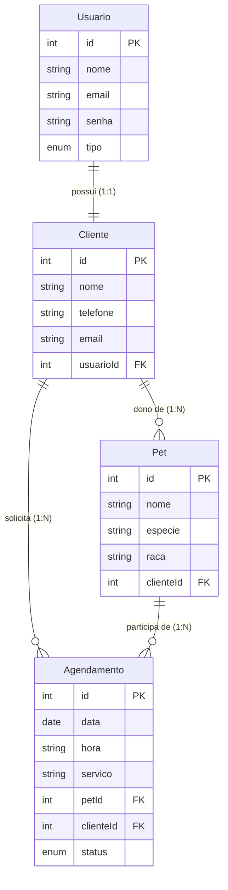

# 🐾 AmorPet — Sistema de Agendamento e Gestão de Pets

O **AmorPet** é um sistema completo (Full Stack) desenvolvido para pet shops e clínicas veterinárias. O projeto permite que clientes criem suas contas, gerenciem o cadastro de seus pets e agendem consultas ou serviços (como banho, tosa e vacinas) escolhendo horários disponíveis, visualizando tudo em um painel interativo (Dashboard).

Este projeto foi construído seguindo boas práticas de arquitetura, segurança e organização de código, ideal para demonstrar habilidades de desenvolvimento backend e frontend.

---

## 🚀 Tecnologias Utilizadas

### Backend
* **Runtime:** Node.js (com suporte nativo a ES Modules)
* **Framework:** Express.js
* **Banco de Dados:** MySQL
* **ORM:** Sequelize
* **Segurança:** 
  * Criptografia de senhas com `bcrypt`
  * Autenticação via JSON Web Tokens (`JWT`)
  * Proteção contra ataques de força bruta com `express-rate-limit`
  * CORS habilitado para segurança do domínio

### Frontend
* **Biblioteca:** React.js (com React Router v6 para navegação)
* **Integração:** Axios (com interceptadores de requisição/resposta para renovação e envio de token JWT)
* **Animações:** Framer Motion (para transições suaves na interface)
* **Estilização:** CSS Vanilla estruturado

---

## 📊 Arquitetura do Banco de Dados

Os dados são estruturados de forma relacional no MySQL. Abaixo está o diagrama das tabelas e seus relacionamentos:



---

## 🛠️ Como Executar o Projeto Localmente

### Pré-requisitos
* Node.js instalado (versão 18 ou superior)
* MySQL instalado e rodando localmente

### 1. Configurando o Banco de Dados
Crie um banco de dados MySQL chamado `amorpet` executando o comando no seu terminal SQL:
```sql
CREATE DATABASE amorpet;
```

### 2. Configurando o Backend
1. Abra um terminal e vá até a pasta backend:
   ```bash
   cd backend
   ```
2. Instale as dependências:
   ```bash
   npm install
   ```
3. Crie um arquivo `.env` na raiz do backend baseando-se no `.env.example` e preencha com as suas credenciais locais do MySQL:
   ```env
   JWT_SECRET=sua_chave_secreta_jwt
   DB_NAME=amorpet
   DB_USER=seu_usuario_do_banco
   DB_PASSWORD=sua_senha_do_banco
   DB_HOST=localhost
   ```
4. Inicie o servidor em modo de desenvolvimento:
   ```bash
   npm run dev
   ```
   *O backend rodará na porta `3001`.*

### 3. Configurando o Frontend
1. Abra um novo terminal e vá até a pasta frontend:
   ```bash
   cd frontend
   ```
2. Instale as dependências:
   ```bash
   npm install
   ```
3. Inicie a aplicação React:
   ```bash
   npm start
   ```
   *O frontend rodará na porta `3000` (ou na próxima porta disponível).*

---

## 🔒 Boas Práticas e Segurança Implementadas
* **Proteção de Rotas:** O middleware de autenticação verifica o token JWT em todas as rotas privadas de clientes, pets e agendamentos.
* **Segurança de Login:** O endpoint de autenticação está protegido com limitação de requisições (`express-rate-limit`) para prevenir ataques de dicionário ou força bruta.
* **Token Expirável:** Os tokens JWT gerados expiram automaticamente em 1 hora, minimizando riscos de segurança.
* **Criptografia de Senha:** As senhas dos usuários nunca são salvas em texto puro no banco de dados; utiliza-se criptografia com salting (`bcrypt`).
